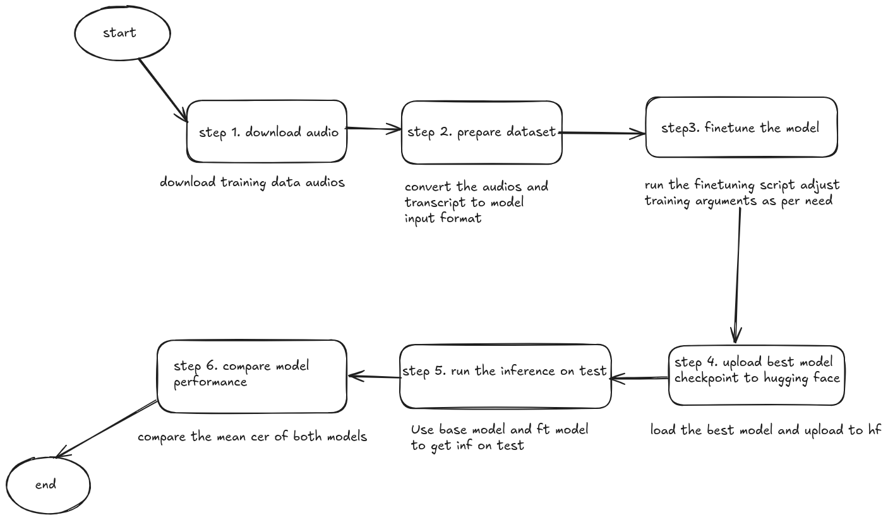

> **Note:** This readme template is based on one from the [Good Docs Project](https://thegooddocsproject.dev). You can find it and a guide to filling it out [here](https://gitlab.com/tgdp/templates/-/tree/main/readme). (_Erase this note after filling out the readme._)

<h1 align="center">
<br>
<a href="https://openpecha.org"></a>
<br>
</h1>

## _Speaker-Specific STT with Wav2Vec2_
_Train a Wav2Vec2 model for speaker-specific accent transcription and compare it with a base model._

## Owner(s)

- [@ngawangtrinley](https://github.com/ngawangtrinley)
- [@mikkokotila](https://github.com/mikkokotila)
- [@evanyerburgh](https://github.com/evanyerburgh)


## Table of contents
<p align="center">
<a href="#project-description">Project description</a> •
<a href="#who-this-project-is-for">Who this project is for</a> •
<a href="#project-dependencies">Project dependencies</a> •
<a href="#instructions-for-use">Instructions for use</a> •
<a href="#contributing-guidelines">Contributing guidelines</a> •
<a href="#additional-documentation">Additional documentation</a> •
<a href="#how-to-get-help">How to get help</a> •
<a href="#terms-of-use">Terms of use</a>
</p>
<hr>

## Project description

With _Speaker-Specific STT with Wav2Vec2_ you can fine-tune a Wav2Vec2 model on a specific speaker's accent and compare its performance with a base model on that speaker's test dataset.

_Speaker-Specific STT with Wav2Vec2_ helps you create and evaluate speech-to-text models optimized for speaker-specific datasets.


## Who this project is for

This project is intended for data scientists and NLP researchers who want to:
1. Fine-tune pre-trained Wav2Vec2 models on speaker-specific datasets.
2. Evaluate transcription performance improvements.
3. Compare speaker-specific models with general-purpose base models.


## Project dependencies

Before using _Speaker-Specific STT with Wav2Vec2_, ensure you have:
* Python 3.8+
* PyTorch with CUDA (cu124 for GPU support)
* Hugging Face Transformers, Datasets, and Evaluate libraries
* Additional libraries such as `wandb`, `librosa`, and `torchaudio`.

See the `requirements.txt` for detailed dependencies.


## Instructions for use

Get started with _Speaker-Specific STT with Wav2Vec2_ by preparing the dataset and fine-tuning the model.

### Install _Speaker-Specific STT with Wav2Vec2_
1. Clone this repository:
   ```bash
   git clone https://github.com/openpecha/speaker-specific-stt.git
2. Implementation flow
  